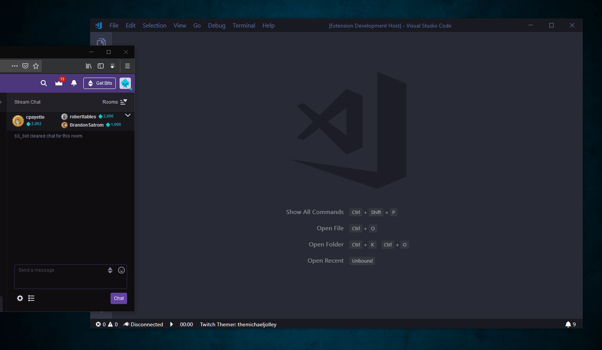

# Twitch Themer


| Release | vNext | Contributors
| -- | -- | --
| [](https://dev.azure.com/michaeljolley/vscode-twitch-themer/_build/latest?definitionId=1&branchName=master) | [](https://dev.azure.com/michaeljolley/vscode-twitch-themer/_build/latest?definitionId=1&branchName=vNext) | [](#contributors)


A Visual Studio Code extension that listens to twitch chat and allows viewers to change the streamers VS Code theme by sending **!theme**

  

## Twitch Chat Commands

#### Send response to chat of current theme

This will send the currently active theme to Twitch chat.

```
!theme
```

#### Receive a list of available theme names

This will send a list of installed VS Code themes to the requestor via whisper. 

```
!theme list
```
`Note: Only 1 whisper per user will be sent per day.`

#### Set VS Code theme

This command will set the theme of the streamers' VS Code workspace to the theme specified.

```
!theme {theme name}
```
`Note: The theme must be previously installed and available within VS Code.`

#### Set Random VS Code theme

This command will set the theme of the streamers' VS Code workspace to a theme that is chosen at random.

```
!theme random
```
`Note: The theme must be previously installed and available within VS Code.`

#### Reset VS Code theme

This command will set the theme of the streamers' VS Code workspace back to the theme that was used at the time the extension connected to chat.

```
!theme reset
```
`Note: Everytime the extension disconnects from chat, the theme will be reset.`


## How to connect to Twitch

- You can login to the twitch chat client using `Twitch Themer: Sign In` command. Execute the commands from vscode command pallete. This will open the Twitch Authentication page. Login to your twitch account. The token is stored in secure keystorage.

- You can logout from the chat once you are done with your twitch session.
- Connect to the chat client using `Twitch Themer: Chat Connect` command.
- Disconnect from the chat client using `Twitch Themer: Chat Disconnect` commands

---

## Attribution & Credits

* Thanks to [Sivamuthu Kumar](https://github.com/ksivamuthu) for the authentication code that we blatantly plagiarized from his [VSCode Peacock Twitch Extension](https://github.com/ksivamuthu/vscode-peacock-twitch-client).
* Thanks to [Brian Clark](https://github.com/clarkio) for his videos on creating VS Code extensions and his [VSCode Twitch Highlighter](https://github.com/clarkio/vscode-twitch-highlighter) extension that really is what brought about the idea for this extension.


## Release Notes

See [CHANGELOG.md](CHANGELOG.md)


## Contributors

Thanks goes to these wonderful people ([emoji key](https://allcontributors.org/docs/en/emoji-key)):

<!-- ALL-CONTRIBUTORS-LIST:START - Do not remove or modify this section -->
<!-- prettier-ignore -->
<table><tr><td align="center"><a href="https://michaeljolley.com/"><br /><sub><b>Michael Jolley</b></sub></a><br /><a href="https://github.com/MichaelJolley/vscode-twitch-themer/commits?author=MichaelJolley" title="Code">💻</a> <a href="https://github.com/MichaelJolley/vscode-twitch-themer/commits?author=MichaelJolley" title="Documentation">📖</a> <a href="#design-MichaelJolley" title="Design">🎨</a> <a href="#ideas-MichaelJolley" title="Ideas, Planning, & Feedback">🤔</a> <a href="#maintenance-MichaelJolley" title="Maintenance">🚧</a></td><td align="center"><a href="https://github.com/PatPat1567"><br /><sub><b>PatPat1567</b></sub></a><br /><a href="https://github.com/MichaelJolley/vscode-twitch-themer/commits?author=PatPat1567" title="Code">💻</a> <a href="#ideas-PatPat1567" title="Ideas, Planning, & Feedback">🤔</a> <a href="https://github.com/MichaelJolley/vscode-twitch-themer/commits?author=PatPat1567" title="Documentation">📖</a></td><td align="center"><a href="https://c-j.tech"><br /><sub><b>Chris Jones</b></sub></a><br /><a href="#ideas-cmjchrisjones" title="Ideas, Planning, & Feedback">🤔</a></td></tr></table>

<!-- ALL-CONTRIBUTORS-LIST:END -->

This project follows the [all-contributors](https://github.com/all-contributors/all-contributors) specification. Contributions of any kind welcome!
